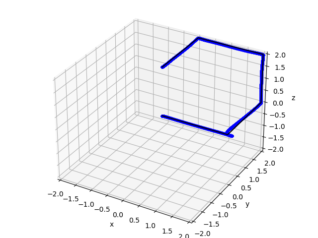

# Quadrotor Controller and Trajectory Generator

In the first phase of this project, I implemented a geometric non-linear controller to control the quadrotor. Then, a waypoint trajectory
generator was implemented using minimum jerk trajectories to fly the quadcopter between a start and goal point. The results are shown below.

Cube Flight Path         |  Animation
:-------------------------:|:-------------------------:
        |  

My lab team and I had the opportunity to test our code on a real quadcopter. In the gif below my controller code was used along with
a team member's waypoint trajectory generator. The quadrotor can be seen tracing out a square. The quadcopter is a little jumpy at first. The simulator is an ideal environment to test the code in so this behavior is expected in a real world test and would've been fixed by adjusting the gains a bit. 

Quadcopter Tracing Square     
:-------------------------:

