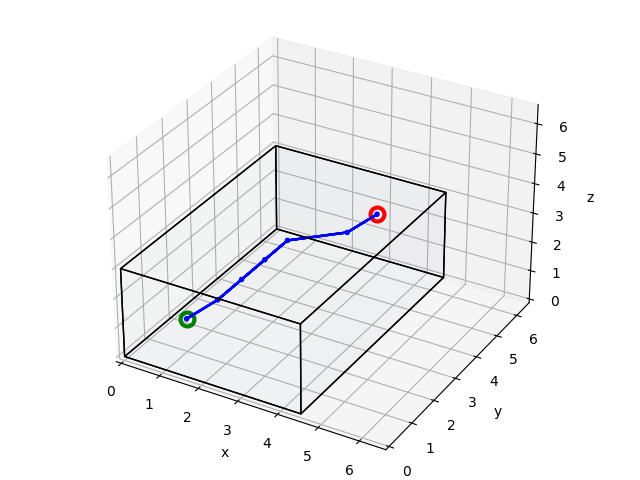
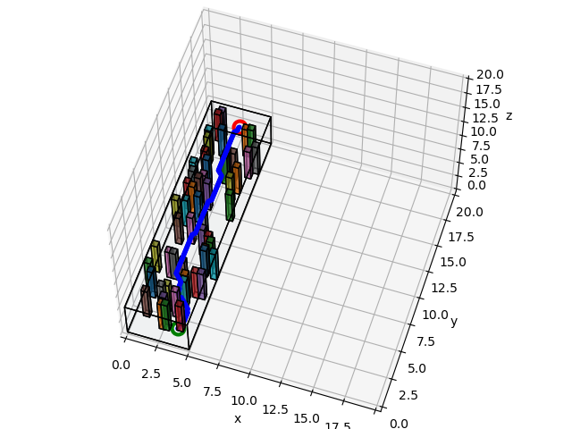

# Dijkstra and A* Search

In the second phase of this project, I implemented Dijkstra and A* search algorithms to find a path between start and goal in a map of obstacles.
A few maps with A* calculated paths are shown below.

Empty         |  Saw
:-------------------------:|:-------------------------:
        |  

Forest         |  Window
:-------------------------:|:-------------------------:
        |  
