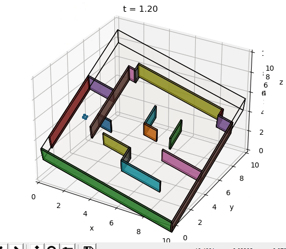

# Quadrotor Control and Trajectory

In the third phase of this project, I combined phase 1 and phase 2. The controller was completed in phase 1 and Dijkstra and A* search were 
implemented in phase 2. In this phase, superfluous waypoints between the start and goal were removed while allowing the quadcopter to
fly safely between start and goal. A few map animations are shown below.

Maze        
:-------------------------:
     

Window        
:-------------------------:
     

Over Under        
:-------------------------:
     

